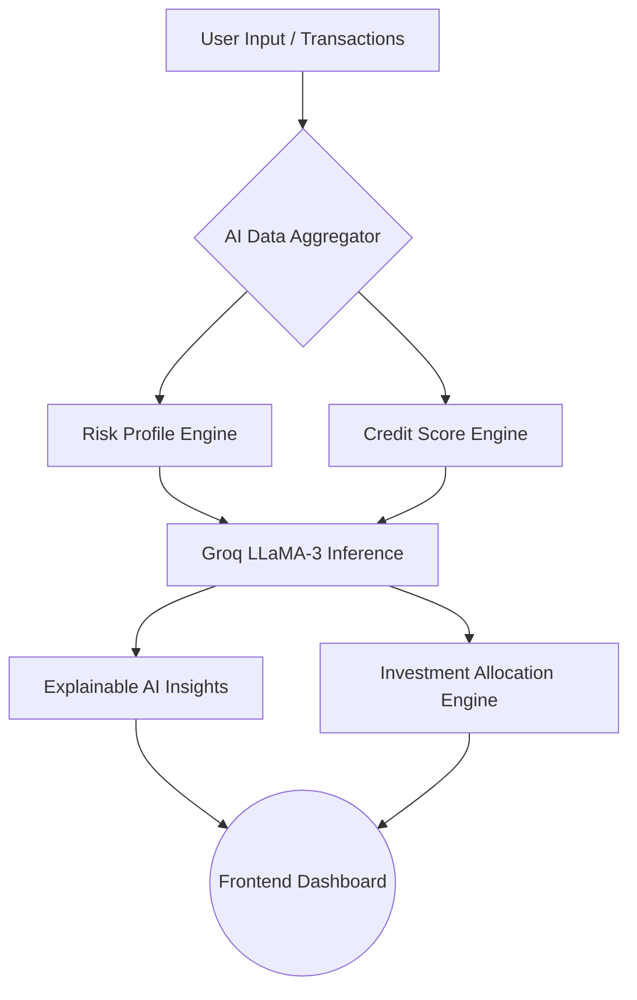
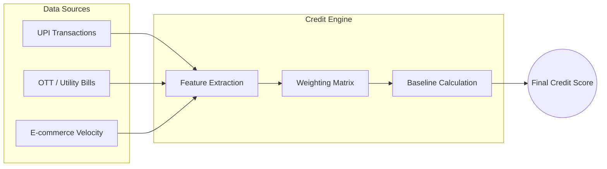
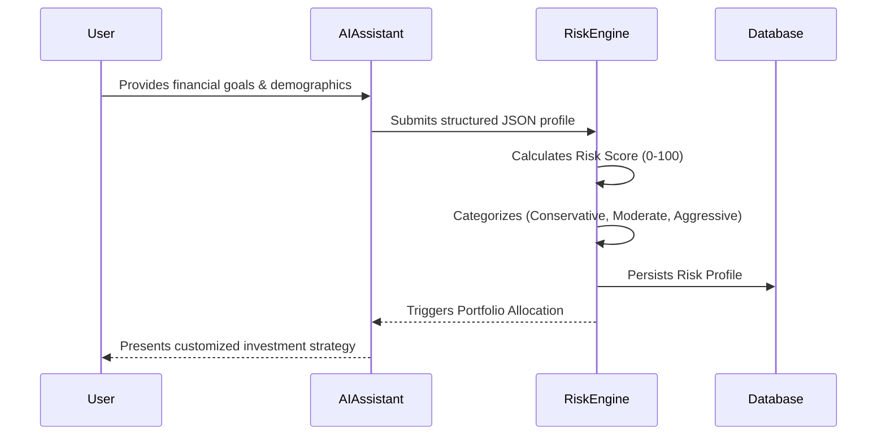
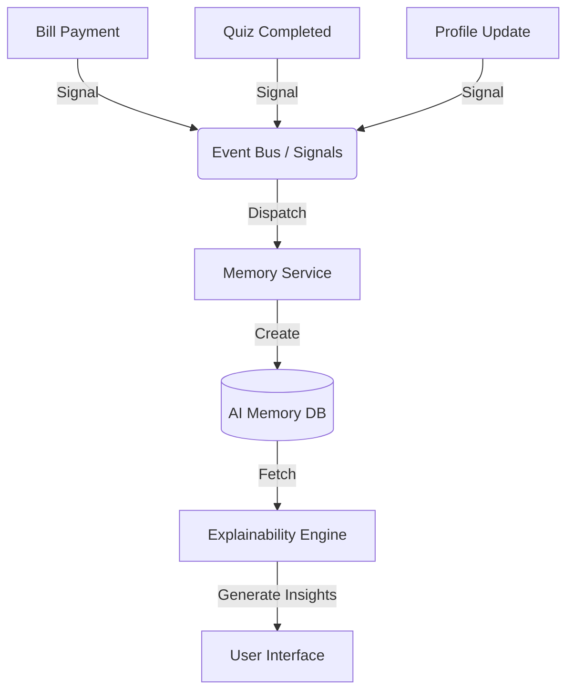
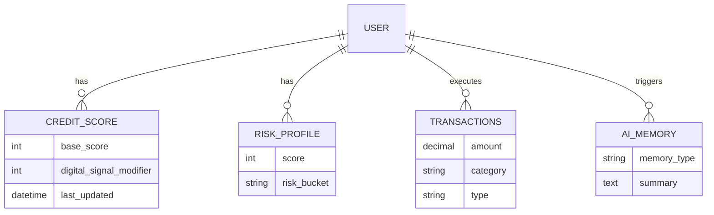
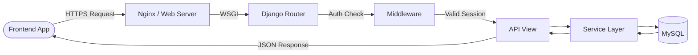

<div align="center">
  
</div>

<br>

<p align="center">
  <code>Transparent AI Credit Intelligence</code> &nbsp;•&nbsp;
  <code>Explainable Wealth Generation</code> &nbsp;•&nbsp;
  <code>Alternative Digital Signals</code>
</p>

---

## 🛠️ Technology Stack

<p align="center">
  <a href="https://skillicons.dev">
    
  </a>
</p>

<p align="center">
  
  
  
  
  
</p>

---

## 🚀 Problem Statement Mapping

**The Challenge:** Traditional credit scoring relies heavily on historical repayment data, excluding millions of "thin-file" or "new-to-credit" users. Furthermore, financial planning tools are often static, offering generic advice rather than personalized, dynamic insights.

**The Finora Solution:**
1. **Alternative Credit Engine:** Ingests non-traditional digital signals (utility bills, OTT subscriptions, UPI transaction behaviors, e-commerce velocity) to generate a holistic, alternative Credit Score.
2. **Explainable AI (XAI):** Moves beyond the "black box" by generating human-readable AI memories that transparently explain *why* a score changed and exactly *what* to do next.
3. **Hyper-Personalized Wealth Management:** Dynamically allocates investment portfolios (Aggressive, Moderate, Conservative) based on continuous behavioral analysis and dynamic risk profiling.

---

## 💎 Key Features

| Feature | Description |
| :--- | :--- |
| **🤖 AI Financial Assistant** | An interactive, conversational LLaMA-3 powered advisor that dynamically assesses risk tolerance and gathers financial goals. |
| **📊 Intelligent Credit Engine** | Processes alternative digital signals alongside traditional inputs to create an inclusive credit score with dynamic modifiers. |
| **🧠 Explainable AI Memory** | An event-driven architecture that tracks financial milestones (e.g., "Paid 3 utility bills on time") and translates them into transparent insights. |
| **📈 Dynamic Wealth Simulator** | Projects portfolio growth using CAGR calculations across different risk scenarios to optimize asset allocation. |
| **🎮 Gamified Learning** | A financial literacy module featuring interactive quizzes, progressive learning tracks, and XP-based achievements. |
| **🔐 Enterprise-Grade Security** | Built on Django 5 with session-based authentication, Google OAuth integration, and secure RESTful endpoints. |

---

## 🏗️ Architecture & Workflows

### 1. Overall System Architecture


### 2. AI Decision Pipeline


### 3. Credit Score Engine Architecture


### 4. Risk Assessment Workflow


### 5. Event-Driven Architecture (AI Memory)


### 6. Database ER Architecture (Core)


### 7. REST API Request Flow


### 8. Project Service Architecture
```text
backend/
├── accounts/           # User models, OAuth, Authentication API
├── ai_assistant/       # Groq integration, conversational logic
├── ai_memory/          # Event tracking, Explainable AI insights
├── config/             # Core Django settings & routing
├── core/               # Shared utilities, base models
├── credit_score/       # Scoring engine, signal modifiers
├── investment/         # Asset allocation, portfolio generation
├── learning/           # Quizzes, educational content
├── notifications/      # Real-time alerts, event subscriptions
├── onboarding/         # Initial user setup flows
├── reports/            # Financial reporting, AI Insights generator
├── risk_profile/       # Risk assessment scoring
├── static/             # Static assets (CSS, JS, Images)
├── templates/          # Frontend HTML rendering (Monolithic views)
├── transactions/       # Spending categorization, history
├── user_profile/       # Profile management, connected services
├── user_settings/      # User preferences
└── web/                # Base views for web frontend
```

---

## 📸 Screenshots

*(Replace the paths below with your actual screenshot images once added to the repository)*

1. **Landing Page:** ``
2. **Dashboard & AI Insights:** ``
3. **Credit Score Engine:** ``
4. **AI Risk Assessment Chat:** ``
5. **Growth Simulator:** ``

---

## ⚙️ Installation & Usage

### Prerequisites
- Python 3.11+
- MySQL 8.0+
- Groq API Key

### Setup Instructions

1. **Clone the repository:**
   ```bash
   git clone https://github.com/your-username/finora.git
   cd finora/backend
   ```

2. **Create a virtual environment:**
   ```bash
   python -m venv venv
   source venv/bin/activate  # On Windows: venv\Scripts\activate
   ```

3. **Install dependencies:**
   ```bash
   pip install -r requirements.txt
   ```

4. **Environment Variables:**
   Create a `.env` file in the `backend/` directory:
   ```env
   SECRET_KEY=your_django_secret
   DEBUG=True
   GROQ_API_KEY=your_groq_api_key
   DB_NAME=finora
   DB_USER=root
   DB_PASSWORD=your_password
   ```

5. **Run Migrations & Seed Data:**
   ```bash
   python manage.py migrate
   python manage.py seed_demo_users  # Seeds database with rich presentation data
   ```

6. **Start the Development Server:**
   ```bash
   python manage.py runserver
   ```
   *Navigate to `http://127.0.0.1:8000` in your browser.*

---

## 📖 API Documentation

Finora follows a strictly separated Service Layer Architecture. Key API endpoints:

- **Authentication:** 
  - `POST /api/auth/login/`
  - `POST /api/auth/register/`
- **Dashboard & Core:**
  - `GET /api/dashboard/summary/`
  - `GET /api/credit-score/`
- **AI & Analytics:**
  - `POST /api/assistant/chat/`
  - `GET /api/reports/insights/`
- **Alternative Signals:**
  - `POST /api/signals/ingest/`

*(A fully interactive Swagger/OpenAPI documentation is available at `/api/docs/` when running locally)*

---

## 🛣️ Roadmap

- [x] **Phase 1:** Core Authentication, Dashboard, and Traditional Financial Tracking.
- [x] **Phase 2:** Integration of Groq LLaMA-3 for Conversational Risk Assessment.
- [x] **Phase 3:** Alternative Credit Engine (Digital Signals) and Explainable AI (XAI) Memory.
- [ ] **Phase 4:** Plaid / Account Aggregator Integration for live bank transaction syncing.
- [ ] **Phase 5:** Mobile Application rollout using React Native.
- [ ] **Phase 6:** Predictive Default Modeling using XGBoost on historical transaction data.

---

## 🔮 Future Scope
As Finora scales, the vision expands into a comprehensive **B2B2C ecosystem**. By white-labeling our Alternative Credit Engine APIs, traditional banks and NBFCs can leverage Finora's AI to underwrite previously "unscorable" individuals. Furthermore, integration with decentralized finance (DeFi) protocols could allow users to seamlessly stake savings directly from the growth simulator.

---
<div align="center">
  <i>Built with ❤️ for the Hackathon</i>
</div>
