<div align="center">


<br/>

[](https://finora.com/)

<br/>

<a href="https://figma.com/">
  
</a>

<br/><br/>


<br/><br/>

```text
🤖 AI ASSISTANT  →  📊 CREDIT SCORE  →  🧠 EXPLAINABLE AI  →  📈 WEALTH GROWTH
```

</div>

---

> **Finora Intelligence** · Next-Gen Financial Operations Platform  
> **Platform Status:** Operational  
> **Architecture:** Full Stack AI Integration  

Finora democratizes credit access and optimizes wealth accumulation by ingesting non-traditional digital signals and delivering Explainable AI insights — built as a central intelligence platform for users' financial health.

<div align="center">

| 🤖 AI Assistant | 📊 Credit Engine | 🧠 XAI Memory | 📈 Wealth |
|:---:|:---:|:---:|:---:|
| Conversational LLaMA-3 | Alternative signals | Transparent insights | Dynamic CAGR projection |
| Dynamic risk profiling | UPI / OTT ingestion | Event-driven tracking | Asset allocation |
| Natural language goals | Baseline modifiers | Milestone highlights | Actionable roadmaps |

</div>

---

## Table of Contents

<details open>
<summary><b>Navigate</b></summary>

| # | Section | # | Section |
|---:|---|---:|---|
| 1 | [Overview](#1-overview) | 6 | [Architecture & Workflows](#6-architecture--workflows) |
| 2 | [Problem Statement](#2-problem-statement) | 7 | [Repository Structure](#7-repository-structure) |
| 3 | [Links & Credentials](#3-links--credentials) | 8 | [Authentication](#8-authentication) |
| 4 | [Features & Deliverables](#4-features--deliverables) | 9 | [Setup (Local)](#9-setup-local) |
| 5 | [Technology Stack](#5-technology-stack) | 10 | [Screenshots](#10-screenshots) |

</details>

---

## 1. Overview

**Finora** is a futuristic, full-stack web application designed to map the entire financial lifecycle of a user. It pushes beyond traditional banking by integrating advanced AI modules:

| Capability | What it does |
|---|---|
| AI Financial Assistant | Conversational interface powered by Groq LLaMA-3 to assess risk tolerance and goals. |
| Alternative Credit Score | Ingests non-traditional digital signals (UPI, OTT, utilities) to generate dynamic scores. |
| Explainable AI (XAI) | Translates credit and risk changes into transparent, human-readable insights. |
| Dynamic Wealth Simulator | Projects portfolio growth using real-time CAGR across different risk buckets. |
| Financial Reports | Dashboards displaying categorized expenses, savings, and performance metrics. |

Stack shape: **Vanilla JS + CSS** frontend · **Django 5** REST API · **MySQL** (local) · Groq LLM · Session Authentication · dark mode.

---

## 2. Problem Statement

### Transparent Credit Scoring & AI-Driven Micro-Investment Advisor for Underserved Users

**Problem Abstract**
Over 190 million adults in India remain credit-invisible, lacking formal credit history, while millions more — especially first-time retail investors from Tier-2 and Tier-3 cities — face information asymmetry, jargon barriers, and absence of personalised guidance for small-ticket investments (Rs. 500–Rs. 5,000/month). 

Participants must build an integrated FinTech prototype that:
1. Designs a credit-likelihood scoring engine ingesting non-traditional digital signals (mobile recharge frequency, utility payment regularity, e-commerce transaction patterns) to produce an interpretable score with top-3 feature explanation and actionable improvement pathway.
2. Profiles a user's risk appetite through a short conversational assessment, maps their profile to suitable instrument categories, and generates a plain-language micro-investment allocation recommendation with a simulated 1–5 year projected growth chart — all built on synthetic or fully consented sample data with a clear disclaimer that outputs are for educational purposes only and do not constitute regulated financial advice.

**Expected Outcomes**
- `→` Feature engineering pipeline for non-traditional digital signals with scoring model and interpretability layer
- `→` Risk bucket classification (Low / Medium / High) with top-3 feature explanations and score-improvement recommendations
- `→` REST API endpoint (Django 5) and dashboard UI showing at least 10 sample user profiles across all risk buckets
- `→` 5-8 question conversational risk-profiling assessment with profile-to-instrument mapping engine
- `→` Plain-language micro-investment recommendation with simulated growth projection chart (3 scenarios)
- `→` Prominent disclaimer on all investment outputs: for educational purposes only, not regulated financial advice

**Evaluation Criteria Mapping**
| Criteria | Implementation in Finora |
|:---|:---|
| **Understanding of Problem** | Directly targets the 190M credit-invisible demographic through digital footprint extraction and jargon-free XAI insights. |
| **Proposed Approach** | Leverages a highly scalable Django 5 + MySQL architecture, driven by Groq LLaMA-3 for real-time conversational profiling and non-traditional credit logic. |
| **Market Fit & Relevance** | Addresses real Tier-2/Tier-3 accessibility gaps with a highly visual UI, micro-investment feasibility (Rs 500+), and completely gamified educational workflows. |

---

## 3. Links & Credentials

| Resource | Link / note |
|---|---|
| Full stack + database | Local — Django `:8000` + MySQL |
| Local API | `http://127.0.0.1:8000` |

### Demo Users (Local)
Run `python manage.py seed_demo_users` to generate the required 10 sample user profiles across risk buckets. Key profiles include:

| Persona | Email | Password | Landing |
|---|---|---|---|
| Conservative | `demo_conservative@finora.com` | `Finora@123` | `/dashboard` |
| Moderate | `demo_moderate@finora.com` | `Finora@123` | `/dashboard` |
| Aggressive | `kabir_growth@finora.com` | `Finora@123` | `/dashboard` |

---

## 4. Features & Deliverables

### Mandatory

| # | Feature | Status |
|---:|---|:---:|
| 01 | Email/password login & Google OAuth | ✅ |
| 02 | Financial Dashboard with live charts & KPI | ✅ |
| 03 | AI Assistant (Conversational Risk Profiling) | ✅ |
| 04 | Alternative Credit Engine (Digital Signals) | ✅ |
| 05 | Explainable AI Insights (XAI) | ✅ |
| 06 | Dynamic Wealth Simulator & CAGR charts | ✅ |
| 07 | Spending categorization & history | ✅ |

### Bonus

| # | Feature | Status |
|---:|---|:---:|
| B1 | Dark mode / Light mode toggle | ✅ |
| B2 | Gamified Financial Learning Module | ✅ |
| B3 | Automated Database Seeder | ✅ |
| B4 | Interactive API Documentation (Swagger) | ✅ |

---

## 5. Technology Stack

<div align="center">

</div>

<br/>

<div align="center">


</div>

---

## 6. Architecture & Workflows

### 6.1 Overall System Architecture
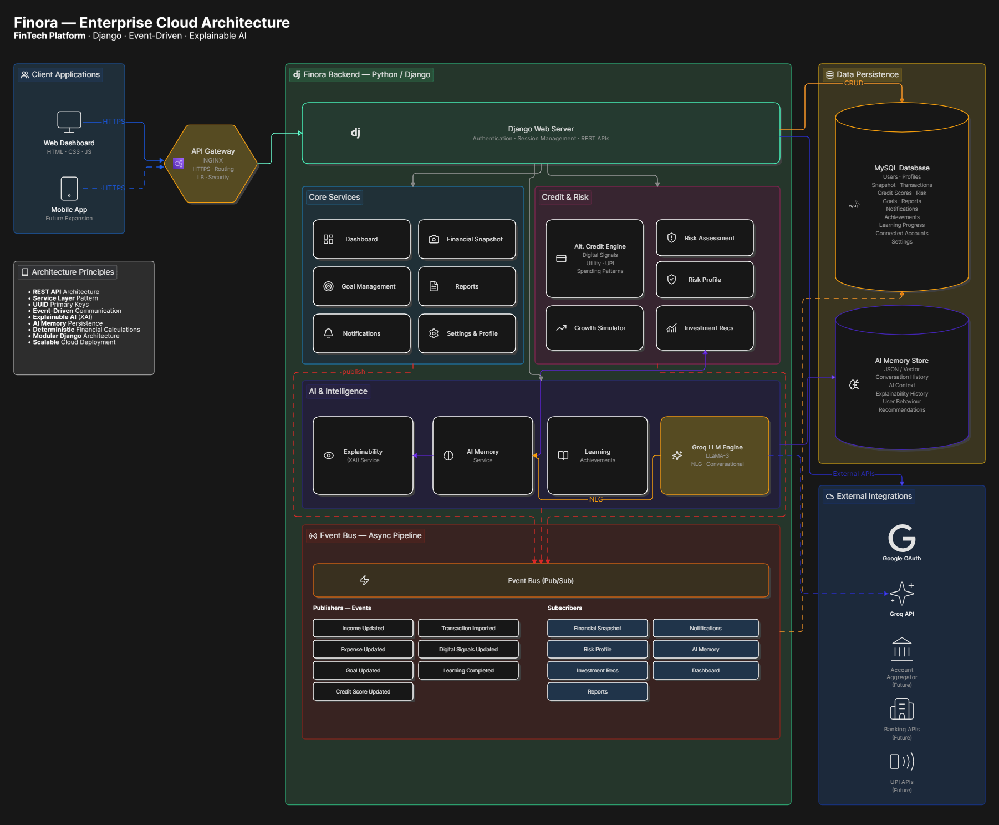

### 6.2 AI Decision Pipeline
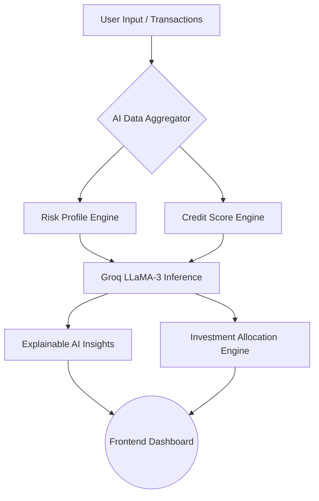

### 6.3 Credit Score Engine Architecture
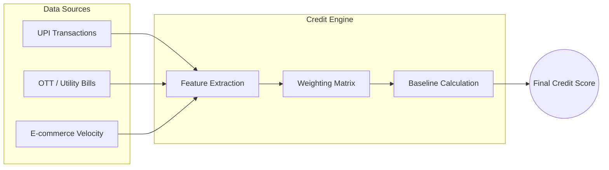

### 6.4 Risk Assessment Workflow
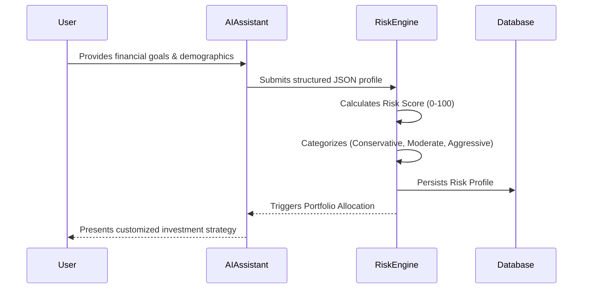

### 6.5 Event-Driven Architecture (AI Memory)
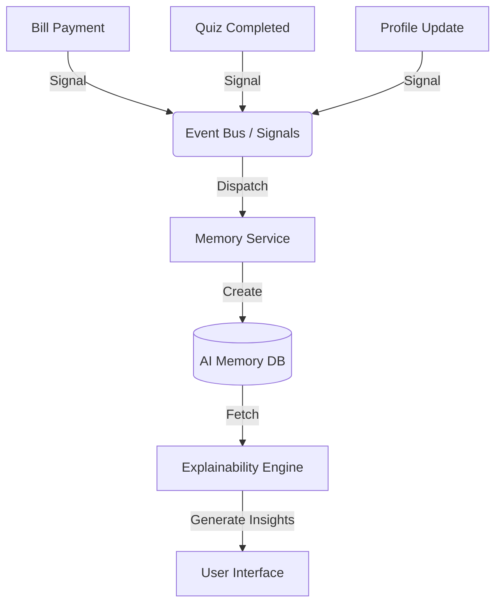

### 6.6 REST API Request Flow


---

## 7. Repository Structure

```text
finora/
├── 01-landing-page/      # UI components and layout for the landing page
├── 02-auth/              # Authentication flows and UI
├── 03-onboarding/        # Initial user setup flows
├── 04-dashboard/         # Main financial dashboard views
├── 05-credit-score/      # Credit score visualization and UI
├── 06-improve-score/     # Actionable tips for credit improvement
├── 07-ai-assistant/      # Conversational interface components
├── 08-risk-profile/      # Risk assessment questionnaire and results
├── 09-investment/        # Investment tracking and recommendations
├── 10-growth-simulator/  # Interactive CAGR charting components
├── 11-reports/           # Financial reports and insights
├── 12-notifications/     # Alert system and history
├── 13-education/         # Financial literacy modules
├── 14-achievements/      # Gamification and XP tracking
├── 15-profile/           # User profile settings
├── 16-settings/          # App configuration and preferences
└── backend/              # Core Django monolithic backend
    ├── accounts/           # User models, OAuth, Authentication API
    ├── ai_assistant/       # Groq integration, conversational logic
    ├── ai_memory/          # Event tracking, Explainable AI insights
    ├── config/             # Core Django settings & routing
    ├── core/               # Shared utilities, base models
    ├── credit_score/       # Scoring engine, signal modifiers
    ├── investment/         # Asset allocation, portfolio generation
    ├── learning/           # Quizzes, educational content
    ├── notifications/      # Real-time alerts, event subscriptions
    ├── onboarding/         # Initial user setup flows
    ├── reports/            # Financial reporting, AI Insights generator
    ├── risk_profile/       # Risk assessment scoring
    ├── static/             # Static assets (CSS, JS, Images)
    ├── templates/          # Frontend HTML rendering (Monolithic views)
    ├── transactions/       # Spending categorization, history
    ├── user_profile/       # Profile management, connected services
    ├── user_settings/      # User preferences
    └── web/                # Base views for web frontend
```

---

## 8. Authentication

Authentication is handled securely via Django's Session framework for traditional email/password logins, alongside a Google OAuth provider integration. User profiles are tracked securely ensuring the AI and financial logic scopes all data directly to the authenticated session context.

---

## 9. Setup (Local)

1. **Clone the repository:**
   ```bash
   git clone https://github.com/your-username/finora.git
   cd finora
   ```

2. **Backend Setup:**
   ```bash
   cd backend
   python -m venv venv
   source venv/bin/activate  # On Windows: venv\Scripts\activate
   pip install -r requirements.txt
   ```

3. **Environment Variables (.env):**
   ```env
   SECRET_KEY=your_django_secret
   DEBUG=True
   GROQ_API_KEY=your_groq_api_key
   DB_NAME=finora
   DB_USER=root
   DB_PASSWORD=your_password
   ```

4. **Run Migrations & Seed Data:**
   ```bash
   python manage.py migrate
   python manage.py seed_demo_users
   ```

5. **Start the Development Server:**
   ```bash
   python manage.py runserver
   ```
   *Navigate to `http://127.0.0.1:8000` in your browser.*

---

## 10. Screenshots

<details>
<summary><b>🚀 Landing Page</b></summary>
<br/>
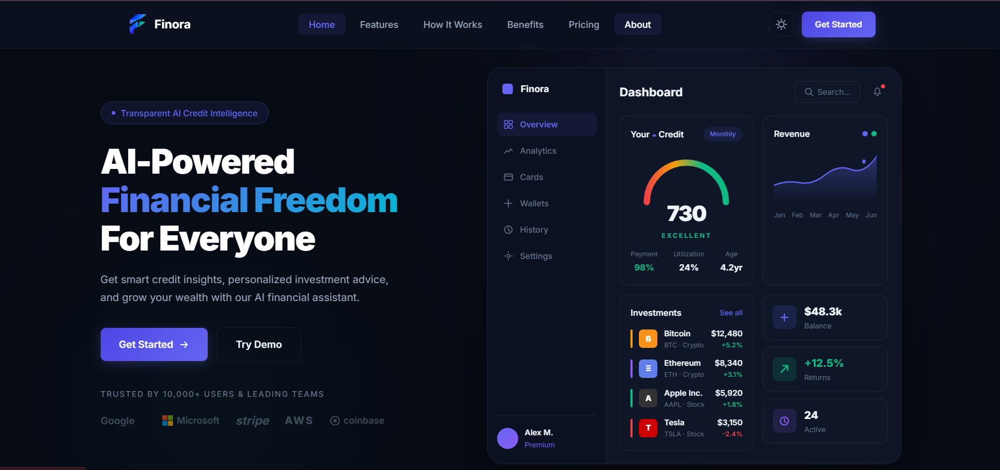
</details>

<details>
<summary><b>📊 Dashboard & Financial Overview</b></summary>
<br/>
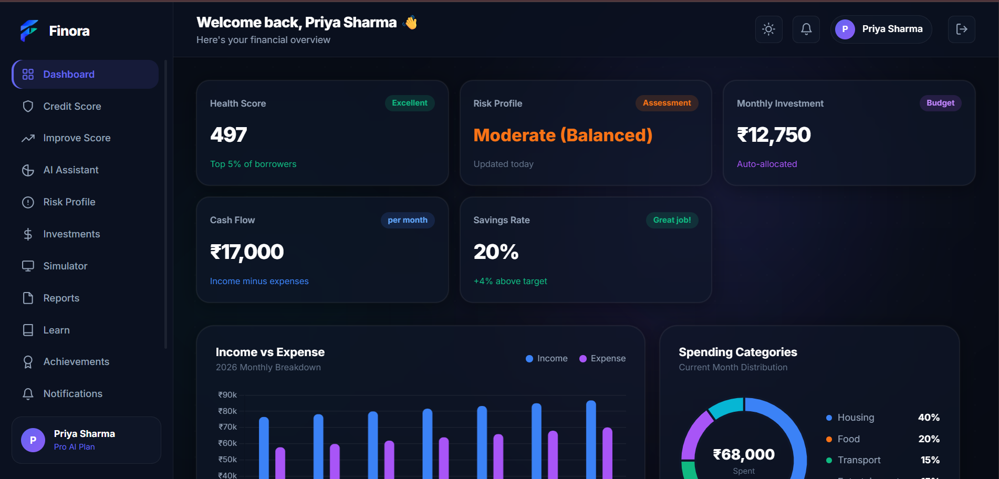
<br/>
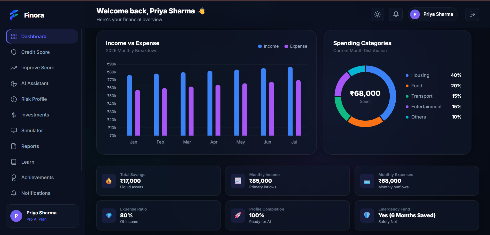
<br/>
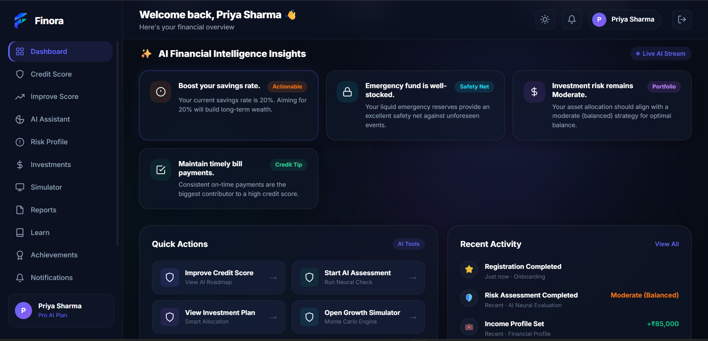
</details>

<details>
<summary><b>📈 Credit Score Engine & Improvement</b></summary>
<br/>
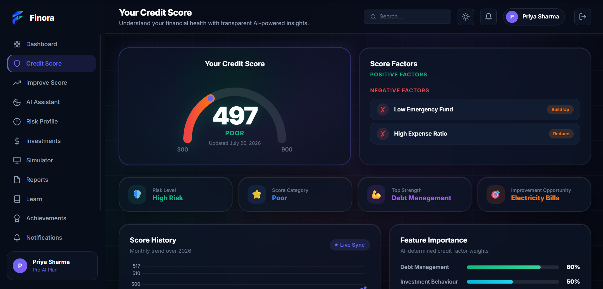
<br/>
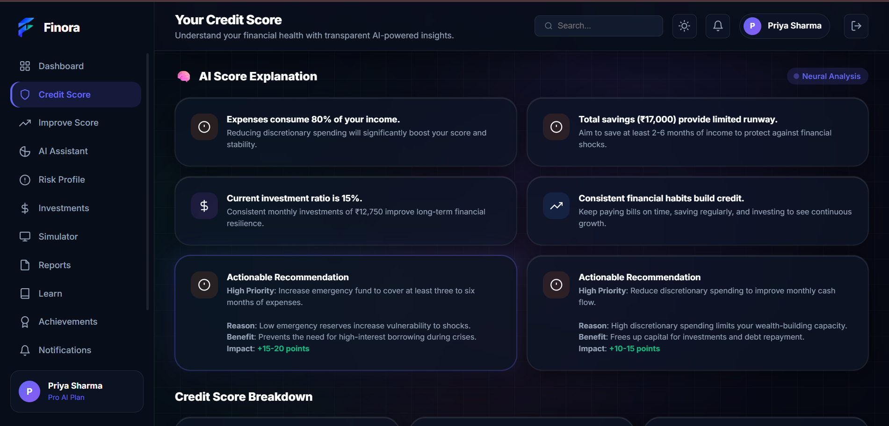
<br/>
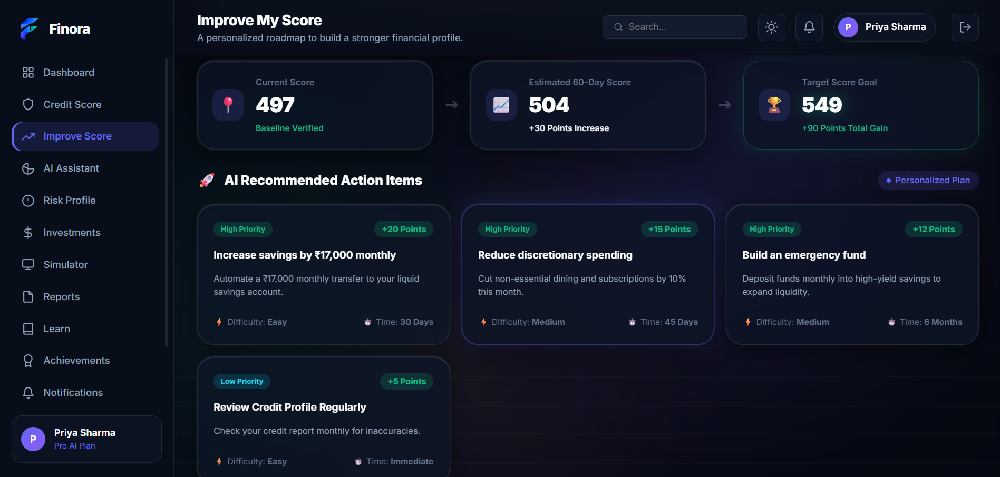
</details>

<details>
<summary><b>🤖 AI Financial Assistant</b></summary>
<br/>
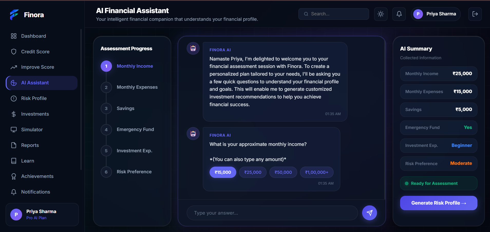
<br/>
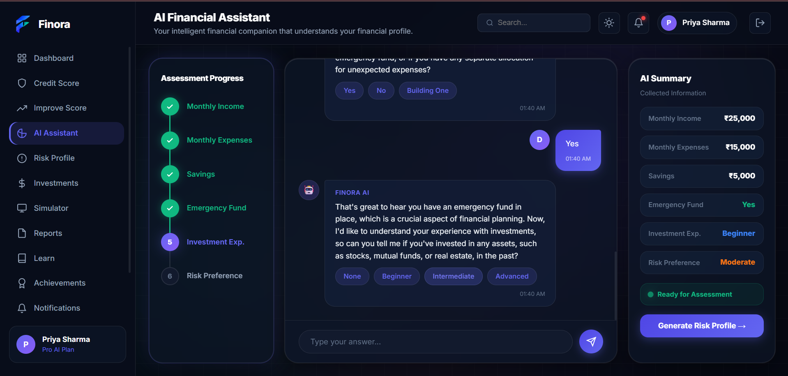
</details>

<details>
<summary><b>💰 Investments & Growth Simulator</b></summary>
<br/>
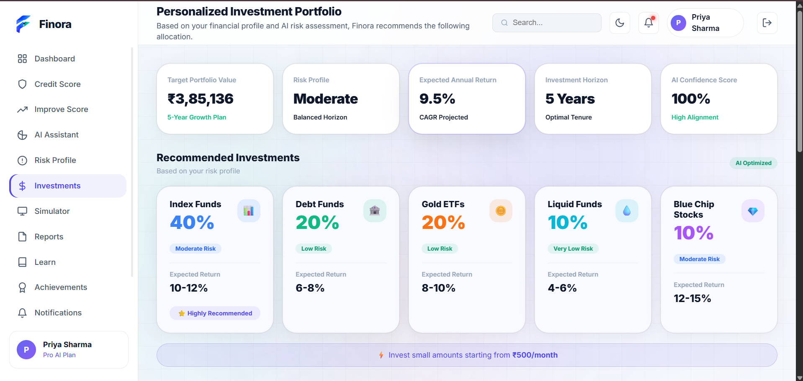
<br/>

</details>

---
<div align="center">
  <i>Built with ❤️ by the Finora Team</i>
</div>
